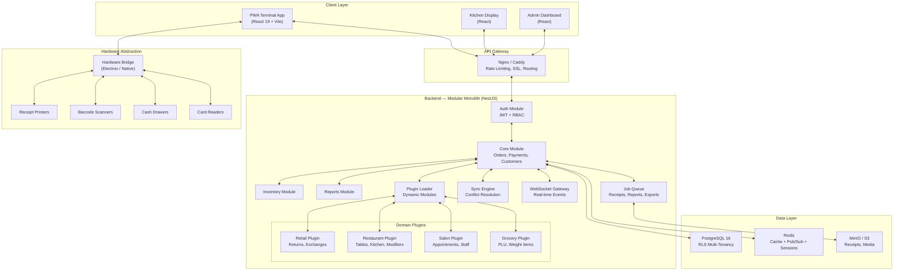
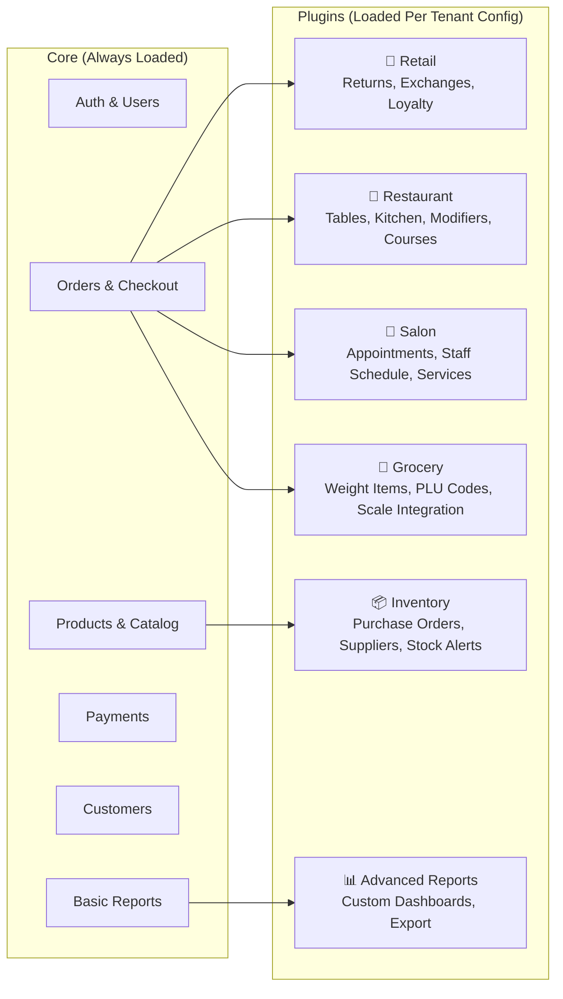
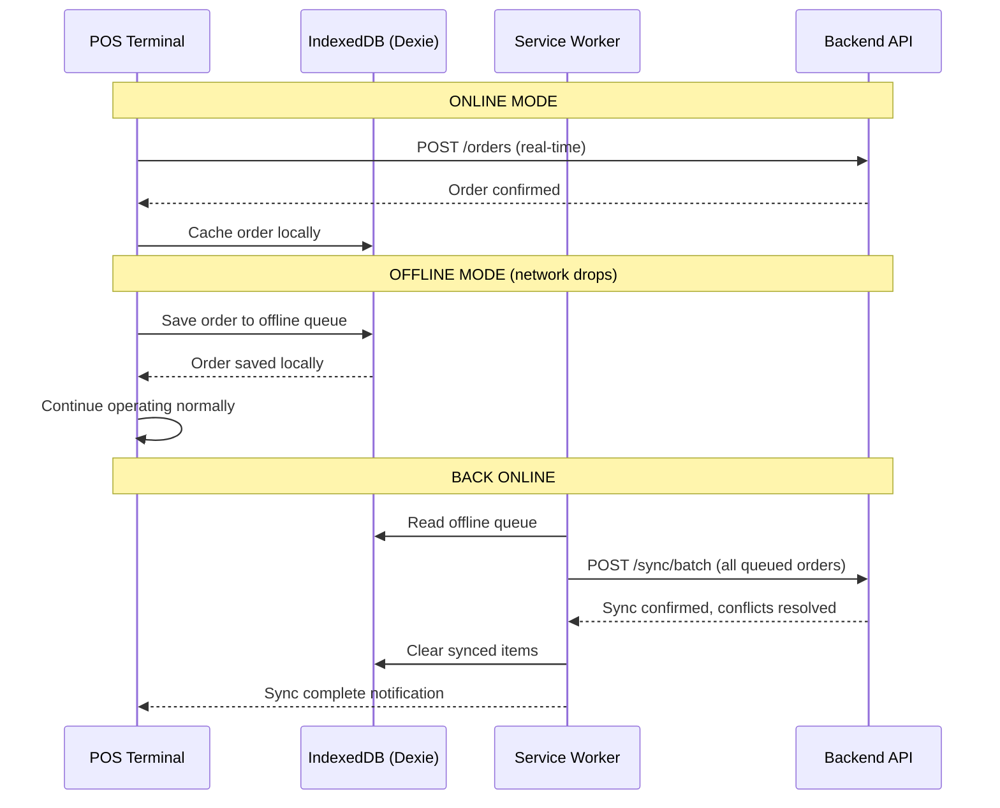

# Universal POS — Architecture & Tech Stack Blueprint

> Designed for multi-tenant, multi-domain customization (retail, restaurant, salon, grocery, etc.)

---

## Core Design Principles

1. **Modular Monolith** — Start as one deployable unit with strict module boundaries. Extract to microservices only when scale demands it.
2. **Plugin Architecture** — Every domain-specific feature (restaurant tables, salon appointments) is a loadable plugin, not core code.
3. **Offline-First** — A POS that dies when WiFi drops is unusable. Every terminal must work offline and sync when reconnected.
4. **Multi-Tenant with Row-Level Security** — One database, tenant isolation enforced at the PostgreSQL level. Cost-effective, easy to maintain.
5. **Configuration over Code** — Customer customizations (fields, workflows, UI layout) are driven by JSON config, not forks.

---

## Architecture Diagram



---

## Recommended Tech Stack

### Frontend

| Concern | Technology | Why |
|---|---|---|
| **Framework** | React 19 *(keep)* | Already in place, massive ecosystem |
| **Build** | Vite 8 *(keep)* | Fastest DX, excellent code splitting |
| **Language** | TypeScript 5.9 *(keep)* | Non-negotiable for enterprise POS |
| **Styling** | Tailwind CSS 4 *(keep)* | Already configured, works well |
| **State (Client)** | Zustand | Tiny (1KB), simple, supports middleware for persistence |
| **State (Server)** | TanStack Query v5 | Caching, background refetch, offline mutation queue |
| **Offline Storage** | Dexie.js (IndexedDB) | Type-safe IndexedDB wrapper, sync-friendly |
| **PWA / Service Worker** | Workbox | Google's battle-tested SW toolkit |
| **Forms** | React Hook Form + Zod | Performant forms with schema validation |
| **Real-time** | Socket.io-client | WebSocket with auto-reconnect and fallback |
| **Charts / Reports** | Recharts | Lightweight, React-native charts |
| **Hardware (optional)** | Electron shell | Only if native hardware access is needed |

### Backend

| Concern | Technology | Why |
|---|---|---|
| **Framework** | NestJS 11 | Modular by design — perfect for plugin architecture. Guards/interceptors for multi-tenancy. Enterprise-proven. |
| **Language** | TypeScript | Shared types with frontend via monorepo |
| **Database** | PostgreSQL 16 | ACID transactions, RLS for tenancy, JSONB for flexible schemas, partitioning for scale |
| **ORM** | Drizzle ORM | Type-safe, SQL-close, fastest Node.js ORM, migration system |
| **Cache** | Redis 7 | Session store, rate limiting, pub/sub for real-time, job queue backend |
| **Auth** | Passport.js + JWT | Multiple strategies (local, OAuth, API keys) |
| **Job Queue** | BullMQ | Receipt generation, report exports, sync jobs, email notifications |
| **WebSocket** | Socket.io (via NestJS gateway) | Kitchen display updates, multi-terminal sync, inventory alerts |
| **File Storage** | MinIO (self-hosted S3) | Receipt PDFs, product images, exports |
| **Validation** | Zod (shared with frontend) | One schema, two runtimes |
| **API Docs** | Swagger via `@nestjs/swagger` | Auto-generated from decorators |

### Infrastructure

| Concern | Technology |
|---|---|
| **Containerization** | Docker + Docker Compose |
| **Reverse Proxy** | Nginx or Caddy |
| **CI/CD** | GitHub Actions |
| **Monitoring** | Prometheus + Grafana |
| **Logging** | Pino (structured JSON logs) |
| **Testing** | Vitest (FE) + Jest (BE) + Playwright (E2E) |

---

## Multi-Tenancy Strategy

### Row-Level Security (RLS) in PostgreSQL

Every table has a `tenant_id` column. PostgreSQL enforces isolation at the database level — even if application code has a bug, one tenant can never see another's data.

```sql
-- Every table gets tenant_id
CREATE TABLE products (
    id UUID PRIMARY KEY DEFAULT gen_random_uuid(),
    tenant_id UUID NOT NULL REFERENCES tenants(id),
    name TEXT NOT NULL,
    sku TEXT,
    price DECIMAL(10,2) NOT NULL,
    custom_fields JSONB DEFAULT '{}',  -- Per-tenant custom fields
    created_at TIMESTAMPTZ DEFAULT NOW()
);

-- RLS policy — invisible to app code
ALTER TABLE products ENABLE ROW LEVEL SECURITY;
CREATE POLICY tenant_isolation ON products
    USING (tenant_id = current_setting('app.tenant_id')::UUID);
```

### Tenant Context Flow

```
Request → Nginx → NestJS Guard extracts tenant from JWT
    → Sets PostgreSQL session variable: SET app.tenant_id = '...'
    → RLS automatically filters ALL queries
    → Response (only tenant's data)
```

### NestJS Tenant Guard

```typescript
@Injectable()
export class TenantGuard implements CanActivate {
  constructor(private dataSource: DataSource) {}

  async canActivate(context: ExecutionContext): Promise<boolean> {
    const request = context.switchToHttp().getRequest();
    const tenantId = request.user?.tenantId;

    if (!tenantId) throw new ForbiddenException('No tenant context');

    // Set RLS context for this request
    await this.dataSource.query(`SET LOCAL app.tenant_id = '${tenantId}'`);
    return true;
  }
}
```

---

## Plugin Architecture (Multi-Domain Support)

This is the key to making one POS work for retail, restaurants, salons, grocery, etc.

### How It Works



### Backend Plugin Definition

```typescript
// Each plugin is a NestJS Dynamic Module
@Module({})
export class RestaurantPlugin {
  static register(config: PluginConfig): DynamicModule {
    return {
      module: RestaurantPlugin,
      imports: [
        TableModule,
        KitchenDisplayModule,
        ModifierModule,
        CourseModule,
      ],
      providers: [
        { provide: 'PLUGIN_CONFIG', useValue: config },
      ],
      exports: [TableModule, KitchenDisplayModule],
    };
  }
}

// Plugin loader reads tenant config and loads only relevant modules
@Module({})
export class PluginLoaderModule {
  static async forTenant(tenantConfig: TenantConfig): Promise<DynamicModule> {
    const plugins = [];

    if (tenantConfig.domain === 'restaurant') {
      plugins.push(RestaurantPlugin.register(tenantConfig.pluginConfig));
    }
    if (tenantConfig.features.includes('advanced-inventory')) {
      plugins.push(AdvancedInventoryPlugin.register(tenantConfig.pluginConfig));
    }

    return { module: PluginLoaderModule, imports: plugins };
  }
}
```

### Frontend Plugin Loading

```typescript
// Plugin registry — maps plugin IDs to lazy-loaded React modules
const pluginRegistry: Record<string, () => Promise<PluginModule>> = {
  'restaurant': () => import('@plugins/restaurant'),
  'retail':     () => import('@plugins/retail'),
  'salon':      () => import('@plugins/salon'),
  'grocery':    () => import('@plugins/grocery'),
};

// Load plugins based on tenant config
function usePlugins(tenantConfig: TenantConfig) {
  const [plugins, setPlugins] = useState<PluginModule[]>([]);

  useEffect(() => {
    const loadPlugins = async () => {
      const loaded = await Promise.all(
        tenantConfig.enabledPlugins
          .filter(id => pluginRegistry[id])
          .map(id => pluginRegistry[id]())
      );
      setPlugins(loaded);
    };
    loadPlugins();
  }, [tenantConfig.enabledPlugins]);

  return plugins;
}

// Each plugin exports: routes, nav items, checkout extensions, settings pages
interface PluginModule {
  id: string;
  name: string;
  routes: RouteObject[];
  navItems: NavItem[];
  checkoutExtensions?: CheckoutExtension[];  // Hooks into checkout flow
  settingsPages?: SettingsPage[];
}
```

### Tenant Configuration (stored in DB, cached in Redis)

```jsonc
{
  "tenantId": "abc-123",
  "businessName": "Mario's Pizzeria",
  "domain": "restaurant",         // Primary domain
  "enabledPlugins": [
    "restaurant",                  // Tables, kitchen display
    "advanced-inventory",          // Stock management
    "loyalty"                      // Points system
  ],
  "customFields": {
    "products": [
      { "key": "spice_level", "type": "select", "options": ["mild", "medium", "hot"] },
      { "key": "allergens", "type": "multi-select", "options": ["gluten", "dairy", "nuts"] }
    ]
  },
  "checkout": {
    "tipEnabled": true,
    "tipPresets": [15, 18, 20, 25],
    "splitBillEnabled": true,
    "courseManagement": true
  },
  "ui": {
    "theme": "dark",
    "primaryColor": "#E53E3E",
    "logo": "https://...",
    "receiptFooter": "Thank you for dining with us!"
  }
}
```

---

## Offline-First Architecture

> **Non-negotiable for POS.** Internet goes down at a busy restaurant — you cannot stop taking orders.



### What's Stored Offline (IndexedDB via Dexie)

| Data | Strategy | Sync Priority |
|---|---|---|
| Product catalog | Full cache, refresh on sync | Low |
| Active orders | Always write-local-first | **Critical** |
| Customer directory | Partial cache (recent 500) | Medium |
| Payment records | Queue for sync | **Critical** |
| Inventory counts | Optimistic local update | High |
| Receipts | Generate locally, sync PDF later | Medium |

---

## Monorepo Structure

```
universal-pos/
├── apps/
│   ├── web/                    # Main POS terminal (React PWA)
│   ├── admin/                  # Admin dashboard (React)
│   ├── kitchen-display/        # KDS app (React, stripped-down)
│   └── api/                    # NestJS backend
│
├── packages/
│   ├── shared-types/           # Zod schemas + TypeScript types
│   ├── shared-utils/           # Date formatting, currency, etc.
│   ├── ui-kit/                 # Shared React components
│   └── db/                     # Drizzle schema + migrations
│
├── plugins/
│   ├── retail/
│   │   ├── api/                # NestJS module
│   │   └── ui/                 # React components + routes
│   ├── restaurant/
│   │   ├── api/
│   │   └── ui/
│   ├── salon/
│   │   ├── api/
│   │   └── ui/
│   └── grocery/
│       ├── api/
│       └── ui/
│
├── docker-compose.yml
├── turbo.json                  # Turborepo config
├── package.json
└── README.md
```

### Why Turborepo?

- Shared `packages/` for types, UI kit, and DB schema
- Parallel builds across apps and plugins
- Remote caching (build once, share across team)
- Dependency graph-aware task running

---

## Database Schema (Core Tables)

```sql
-- Tenant (the business)
CREATE TABLE tenants (
    id UUID PRIMARY KEY DEFAULT gen_random_uuid(),
    name TEXT NOT NULL,
    slug TEXT UNIQUE NOT NULL,       -- "marios-pizza"
    domain TEXT NOT NULL,            -- "restaurant", "retail", "salon"
    config JSONB DEFAULT '{}',       -- Full tenant config (see above)
    plan TEXT DEFAULT 'starter',     -- Billing plan
    created_at TIMESTAMPTZ DEFAULT NOW()
);

-- Users (staff per tenant)
CREATE TABLE users (
    id UUID PRIMARY KEY DEFAULT gen_random_uuid(),
    tenant_id UUID NOT NULL REFERENCES tenants(id),
    email TEXT NOT NULL,
    pin_hash TEXT,                   -- Quick PIN login for terminals
    role TEXT NOT NULL,              -- 'owner', 'manager', 'cashier'
    permissions JSONB DEFAULT '[]',
    UNIQUE(tenant_id, email)
);

-- Products (universal, extended via custom_fields)
CREATE TABLE products (
    id UUID PRIMARY KEY DEFAULT gen_random_uuid(),
    tenant_id UUID NOT NULL REFERENCES tenants(id),
    name TEXT NOT NULL,
    sku TEXT,
    barcode TEXT,
    price DECIMAL(10,2) NOT NULL,
    cost DECIMAL(10,2),
    tax_rate DECIMAL(5,4) DEFAULT 0,
    category_id UUID REFERENCES categories(id),
    track_inventory BOOLEAN DEFAULT true,
    custom_fields JSONB DEFAULT '{}',  -- Domain-specific fields
    is_active BOOLEAN DEFAULT true,
    created_at TIMESTAMPTZ DEFAULT NOW()
);

-- Orders
CREATE TABLE orders (
    id UUID PRIMARY KEY DEFAULT gen_random_uuid(),
    tenant_id UUID NOT NULL REFERENCES tenants(id),
    order_number SERIAL,
    terminal_id UUID,
    cashier_id UUID REFERENCES users(id),
    customer_id UUID REFERENCES customers(id),
    status TEXT DEFAULT 'open',       -- open, completed, voided, refunded
    subtotal DECIMAL(10,2) NOT NULL,
    tax_total DECIMAL(10,2) DEFAULT 0,
    discount_total DECIMAL(10,2) DEFAULT 0,
    grand_total DECIMAL(10,2) NOT NULL,
    payment_status TEXT DEFAULT 'unpaid',
    notes TEXT,
    metadata JSONB DEFAULT '{}',      -- Plugin-specific data (table_id, course, etc.)
    offline_id TEXT,                   -- Client-generated UUID for offline sync
    created_at TIMESTAMPTZ DEFAULT NOW(),
    completed_at TIMESTAMPTZ,
    UNIQUE(tenant_id, offline_id)     -- Prevent duplicate sync
);

-- Order Items
CREATE TABLE order_items (
    id UUID PRIMARY KEY DEFAULT gen_random_uuid(),
    order_id UUID NOT NULL REFERENCES orders(id) ON DELETE CASCADE,
    product_id UUID REFERENCES products(id),
    name TEXT NOT NULL,                -- Snapshot at time of sale
    quantity DECIMAL(10,3) NOT NULL,   -- Decimal for weight-based items
    unit_price DECIMAL(10,2) NOT NULL,
    modifiers JSONB DEFAULT '[]',      -- [{name, price}] for restaurant
    discount DECIMAL(10,2) DEFAULT 0,
    tax DECIMAL(10,2) DEFAULT 0,
    total DECIMAL(10,2) NOT NULL
);

-- Payments
CREATE TABLE payments (
    id UUID PRIMARY KEY DEFAULT gen_random_uuid(),
    tenant_id UUID NOT NULL REFERENCES tenants(id),
    order_id UUID NOT NULL REFERENCES orders(id),
    method TEXT NOT NULL,              -- 'cash', 'card', 'mobile', 'split'
    amount DECIMAL(10,2) NOT NULL,
    reference TEXT,                    -- Transaction ID from payment processor
    status TEXT DEFAULT 'completed',
    metadata JSONB DEFAULT '{}',
    created_at TIMESTAMPTZ DEFAULT NOW()
);
```

---

## Key Decisions & Tradeoffs

| Decision | Choice | Alternative Considered | Why |
|---|---|---|---|
| Monolith vs Microservices | **Modular Monolith** | Microservices | One deploy, one DB, simpler ops. Module boundaries let you extract later. |
| Multi-tenancy | **RLS (Row-Level)** | Schema-per-tenant | 1 schema = simple migrations, lower cost. RLS gives true isolation. |
| ORM | **Drizzle** | Prisma | Drizzle is faster, SQL-close, lighter. Prisma's query engine adds latency. |
| Backend framework | **NestJS** | Fastify bare, Express | Dynamic modules = plugin system for free. Guards = tenancy for free. |
| State management | **Zustand** | Redux Toolkit | POS UI is transactional, not deeply nested. Zustand is simpler. |
| Offline storage | **Dexie (IndexedDB)** | SQLite (via WASM) | Dexie is browser-native, no WASM overhead, excellent sync patterns. |
| Monorepo tool | **Turborepo** | Nx, pnpm workspaces | Simpler config, excellent caching, less opinionated than Nx. |
| Package manager | **pnpm** | npm, yarn | Fastest installs, strictest dependency resolution, disk-efficient. |

---

## What This Architecture Gives You

| Capability | How |
|---|---|
| **New customer in 5 minutes** | Create tenant → pick domain → enable plugins → done |
| **Custom fields without code** | `custom_fields JSONB` on products, orders, customers |
| **New domain (e.g. "pharmacy")** | Write a new plugin in `plugins/pharmacy/` — zero core changes |
| **Works offline** | IndexedDB + sync queue + conflict resolution |
| **100 tenants, 1 deployment** | RLS isolation, shared infrastructure |
| **Enterprise on-prem** | Docker Compose → ship the whole stack |
| **Hardware integration** | Abstraction layer supports any printer/scanner/drawer via adapters |

---

## Recommended Implementation Order

### Phase 1 — Foundation (Weeks 1-3)
- [ ] Set up Turborepo monorepo with `apps/api`, `apps/web`, `packages/shared-types`, `packages/db`
- [ ] NestJS API with Auth module (JWT + PIN login)
- [ ] PostgreSQL + Drizzle schema (tenants, users, products, orders, payments)
- [ ] RLS policies + TenantGuard
- [ ] React app: Login → Dashboard shell

### Phase 2 — Core POS (Weeks 4-7)
- [ ] Product catalog (CRUD + categories + barcode)
- [ ] Checkout flow (cart → payment → receipt)
- [ ] Basic payment processing (cash + card stub)
- [ ] Customer management
- [ ] Receipt generation (thermal printer format)
- [ ] Zustand cart store + TanStack Query for data

### Phase 3 — Offline & Real-time (Weeks 8-9)
- [ ] Dexie.js offline storage + sync engine
- [ ] Service Worker (Workbox) for PWA
- [ ] WebSocket gateway for multi-terminal sync
- [ ] Conflict resolution for offline orders

### Phase 4 — First Plugin (Week 10-11)
- [ ] Plugin loader architecture (backend + frontend)
- [ ] Retail plugin (returns, exchanges, loyalty)
- [ ] Tenant config system + admin panel

### Phase 5 — Scale (Week 12+)
- [ ] Restaurant plugin (tables, kitchen display, modifiers)
- [ ] Advanced reporting + dashboards
- [ ] Payment gateway integrations (Stripe, Square)
- [ ] Hardware abstraction layer
