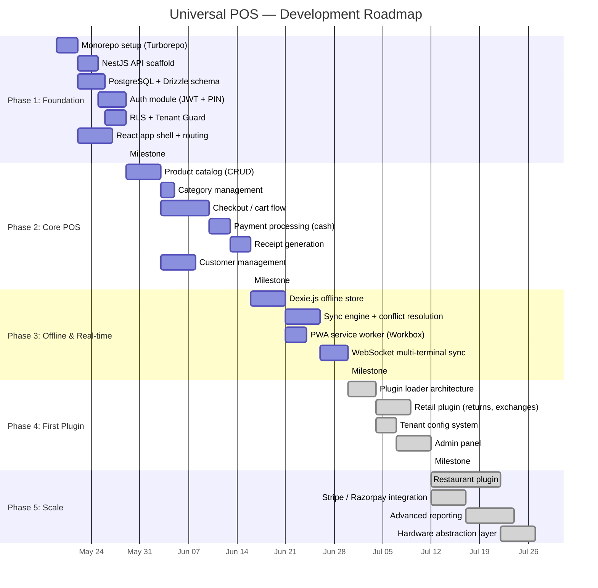

# TuxedoPOS — Project Hub

> **Living document** — Single source of truth for all project decisions, progress, and tracking.
> Last updated: 2026-05-14
> **Product:** TuxedoPOS — Vertical SaaS POS for Tuxedo & Formal Wear Businesses
> **Deadline:** 1 week (by ~2026-05-21)
> **Market:** 🇺🇸 US Only
> **Status:** 🟢 ALL DECISIONS LOCKED — BUILDING

---

## Table of Contents

1. [Decisions Needed From You](#decisions-needed-from-you)
2. [Project Requirements](#project-requirements)
3. [Agreed Architecture](#agreed-architecture)
4. [Tech Stack (Confirmed vs Pending)](#tech-stack)
5. [Roadmap & Milestones](#roadmap--milestones)
6. [Progress Tracker](#progress-tracker)
7. [Bug Tracker](#bug-tracker)
8. [Open Questions](#open-questions)
9. [Suggestions & Ideas Backlog](#suggestions--ideas-backlog)
10. [Meeting Notes / Decision Log](#decision-log)

---

## Decisions Needed From You

> [!NOTE]
> ✅ All blocking decisions resolved. Building has commenced.

### 1. 🎯 Domain
**Status:** ✅ CONFIRMED

**Domain:** Tuxedo & Formal Wear Vertical SaaS
- NOT a generic POS — a specialized platform for tuxedo/formal wear rental and tailoring businesses
- Core differentiators: Rental management, measurement profiles, tailoring workflow, appointment scheduling
- Target customer: Tuxedo stores, bridal wear shops, formal wear boutiques

---

### 2. 🏗️ Backend Stack Confirmation
**Question:** Do you agree with the proposed backend?

| Component | Proposed | Notes |
|---|---|---|
| Framework | NestJS 11 | Modular, enterprise-grade |
| Database | PostgreSQL 16 | RLS for multi-tenancy |
| ORM | Drizzle ORM | Fast, type-safe |
| Cache | Redis 7 | Sessions, pub/sub |
| Queue | BullMQ | Background jobs |

**Your choice:** `Agree / Suggest changes: ________________`

---

### 3. 🌐 Deployment Model
**Status:** ⏳ Pending confirmation

> **Assumption:** Cloud SaaS — you host, businesses subscribe. Confirm if different.

---

### 4. 🏠 Hosting / Infrastructure
**Question:** Where do you want to host?

| Option | Monthly Cost (estimate) | Notes |
|---|---|---|
| **A) AWS** | $50-200+ | Most scalable, most complex |
| **B) DigitalOcean** | $30-100 | Simple, good for MVPs |
| **C) Railway / Render** | $20-80 | Zero-ops, fastest to deploy |
| **D) VPS (Hetzner/Contabo)** | $10-40 | Cheapest, manual setup |
| **E) Decide later** | — | Build locally first |

**Your choice:** `________________`

---

### 5. 💳 Payment Processors
**Question:** Which payment gateways should we integrate?

| Option | Region | Card | UPI/Wallet |
|---|---|---|---|
| **Stripe** | Global | ✅ | Limited |
| **Razorpay** | India | ✅ | ✅ UPI, Wallets |
| **Square** | US/UK/AU/CA | ✅ | ❌ |
| **PayPal** | Global | ✅ | ❌ |
| **Cash only (MVP)** | — | ❌ | ❌ |

> **My recommendation:** Start with **Cash + Stripe** (global reach). Add Razorpay if India is a primary market.

**Your choice:** `________________`

---

### 6. 🖨️ Hardware Support (MVP)
**Question:** Which hardware do we need to support in v1?

| Hardware | Priority | Notes |
|---|---|---|
| Receipt printer (thermal) | ❓ | ESC/POS protocol, USB/Bluetooth |
| Barcode scanner | ❓ | USB HID (works like a keyboard) |
| Cash drawer | ❓ | Triggered via printer usually |
| Card reader | ❓ | Depends on payment processor |
| Weight scale | ❓ | Only for grocery domain |
| Customer display | ❓ | Secondary screen showing total |

> **My recommendation:** For MVP, skip hardware. Barcode scanners work as USB keyboards automatically. Receipt = PDF/email first, thermal printer later.

**Your choice:** `________________`

---

### 7. 👤 Authentication Requirements
**Question:** How should staff log in?

| Method | Use Case |
|---|---|
| **Email + Password** | Manager/Admin login |
| **PIN code (4-6 digits)** | Quick cashier login at terminal |
| **Fingerprint/Face ID** | Premium, needs native app |
| **OAuth (Google/Microsoft)** | Corporate customers |

> **My recommendation:** **Email + Password** for admins, **PIN** for cashiers. This is standard POS.

**Your choice:** `________________`

---

### 8. 📱 Platform Strategy
**Question:** What platforms do we need?

| Platform | Technology | Priority |
|---|---|---|
| **Web (PWA)** | React + Service Worker | Must have |
| **Desktop app** | Electron wrapper around PWA | Nice to have |
| **iOS app** | React Native or native | Later |
| **Android app** | React Native or native | Later |
| **Kitchen Display** | Separate React app | Only for restaurant |

> **My recommendation:** **PWA only** for MVP. It works on any device with a browser. Electron if we need hardware access.

**Your choice:** `________________`

---

### 9. 🏢 Target Market
**Question:** Who is the primary customer?

| Segment | Characteristics |
|---|---|
| **A) Small businesses** | 1-5 terminals, simple needs, price-sensitive |
| **B) Mid-market chains** | 5-50 locations, need multi-store reporting |
| **C) Enterprise** | 50+ locations, need on-prem, SSO, custom SLAs |
| **D) All of the above** | Build for small, upsell to enterprise |

**Your choice:** `________________`

---

### 10. 🎨 Branding
**Status:** 🟡 Partially confirmed

| Item | Status | Value |
|---|---|---|
| **Product name** | ✅ Confirmed | **TuxedoPOS** |
| **Primary color** | ⏳ Pending | Need your input |
| **Dark mode default?** | ⏳ Pending | Need your input |
| **Logo** | ⏳ Pending | Generate one? |
| **Tagline** | ⏳ Pending | e.g., "Dressed for every occasion" |

---

### 11. 👥 Team & Timeline
**Question:** Who's building this and when do you need it?

| Item | Your Input |
|---|---|
| **Team size** | Just you + me? Others? |
| **Frontend devs** | `___` |
| **Backend devs** | `___` |
| **Target MVP date** | `________________` |
| **Working hours/week on this** | `________________` |

---

### 12. 🔒 Compliance & Legal
**Question:** Any regulatory requirements?

| Requirement | Needed? |
|---|---|
| **PCI DSS** (card payment data) | ❓ (Stripe/Razorpay handle this for us) |
| **GDPR** (EU customer data) | ❓ |
| **GST compliance** (India) | ❓ |
| **Multi-currency** | ❓ |
| **Multi-language (i18n)** | ❓ |
| **Fiscal receipt regulations** | ❓ (varies by country) |

**Your notes:** `________________`

---

## Project Requirements

### Functional Requirements (Core — All Domains)

| # | Requirement | Priority | Status |
|---|---|---|---|
| FR-01 | Multi-tenant system with tenant isolation | P0 | 📋 Planned |
| FR-02 | User authentication (email + PIN) | P0 | 📋 Planned |
| FR-03 | Role-based access control (owner, manager, cashier) | P0 | 📋 Planned |
| FR-04 | Product catalog (CRUD, categories, variants) | P0 | 📋 Planned |
| FR-05 | Barcode/SKU lookup | P0 | 📋 Planned |
| FR-06 | Shopping cart / checkout flow | P0 | 📋 Planned |
| FR-07 | Payment processing (cash + card) | P0 | 📋 Planned |
| FR-08 | Receipt generation (digital + print) | P0 | 📋 Planned |
| FR-09 | Customer management (directory, purchase history) | P1 | 📋 Planned |
| FR-10 | Basic inventory tracking (stock in/out) | P1 | 📋 Planned |
| FR-11 | Daily sales reports | P1 | 📋 Planned |
| FR-12 | Multi-terminal support | P1 | 📋 Planned |
| FR-13 | Offline mode with sync | P1 | 📋 Planned |
| FR-14 | Tax calculation (configurable rates) | P0 | 📋 Planned |
| FR-15 | Discount system (%, fixed, coupon codes) | P1 | 📋 Planned |
| FR-16 | Cash management (open/close register, cash counts) | P1 | 📋 Planned |
| FR-17 | Refund / void transactions | P1 | 📋 Planned |
| FR-18 | Plugin system for domain-specific features | P0 | 📋 Planned |
| FR-19 | Tenant onboarding (self-service or admin) | P2 | 📋 Planned |
| FR-20 | Admin dashboard (super-admin for all tenants) | P2 | 📋 Planned |

### Non-Functional Requirements

| # | Requirement | Target | Status |
|---|---|---|---|
| NFR-01 | Checkout transaction time | < 500ms | 📋 Planned |
| NFR-02 | Offline operation duration | Unlimited (sync on reconnect) | 📋 Planned |
| NFR-03 | Concurrent terminals per tenant | 20+ | 📋 Planned |
| NFR-04 | Data isolation | PostgreSQL RLS, zero cross-tenant leakage | 📋 Planned |
| NFR-05 | Uptime SLA | 99.9% | 📋 Planned |
| NFR-06 | PWA Lighthouse score | > 90 | 📋 Planned |
| NFR-07 | Mobile responsive | Full touch-optimized UI | 📋 Planned |
| NFR-08 | API response time (p95) | < 200ms | 📋 Planned |

---

## Agreed Architecture

> See [universal_pos_architecture.md](file:///Users/diaspark/.gemini/antigravity/brain/bb7f7cc3-6920-4603-9aac-5dff8e44d300/universal_pos_architecture.md) for the full blueprint.

**Summary:**
- **Pattern:** Modular Monolith with Plugin Architecture
- **Multi-tenancy:** PostgreSQL Row-Level Security
- **Offline:** IndexedDB (Dexie.js) + sync queue
- **Real-time:** WebSocket via Socket.io
- **Monorepo:** Turborepo + pnpm

---

## Tech Stack

| Layer | Technology | Status |
|---|---|---|
| **Frontend** | React 19 + Vite 8 + TypeScript 5.9 | ✅ Confirmed (existing) |
| **Styling** | Tailwind CSS 4 | ✅ Confirmed (existing) |
| **Client State** | Zustand | 📋 Proposed |
| **Server State** | TanStack Query v5 | 📋 Proposed |
| **Offline** | Dexie.js + Workbox | 📋 Proposed |
| **Forms** | React Hook Form + Zod | 📋 Proposed |
| **Backend** | NestJS 11 | ⏳ Awaiting confirmation |
| **Database** | PostgreSQL 16 | ⏳ Awaiting confirmation |
| **ORM** | Drizzle ORM | ⏳ Awaiting confirmation |
| **Cache** | Redis 7 | ⏳ Awaiting confirmation |
| **Queue** | BullMQ | ⏳ Awaiting confirmation |
| **Monorepo** | Turborepo + pnpm | 📋 Proposed |
| **Testing** | Vitest + Jest + Playwright | 📋 Proposed |
| **CI/CD** | GitHub Actions | 📋 Proposed |
| **Containerization** | Docker + Docker Compose | 📋 Proposed |

---

## Roadmap & Milestones

### Milestone Summary

| Milestone | Target | Deliverable |
|---|---|---|
| **M1: Foundation** | Week 3 | Auth working, DB schema live, app shell rendered |
| **M2: Core POS** | Week 7 | Can scan products, checkout, take cash payment, generate receipt |
| **M3: Offline-First** | Week 9 | Works without internet, syncs on reconnect |
| **M4: MVP** | Week 11 | Plugin system, retail domain, tenant config, admin panel | ✅ |
| **M5: Scale** | Week 14+ | Restaurant domain, card payments, reporting, hardware | ✅ |

---

## Progress Tracker

### Current Sprint: **Week 1 — Day 1 ✅**

| Task | Assignee | Status | Notes |
|---|---|---|---|
| Design system (CSS) | Antigravity | ✅ Done | Navy/gold palette, light+dark modes, all component classes |
| Login page | Antigravity | ✅ Done | Email+PIN dual mode, premium split-panel layout |
| Auth context | Antigravity | ✅ Done | Owner/Manager/Cashier roles, localStorage persistence |
| Sidebar navigation | Antigravity | ✅ Done | Collapsible, role-based, active states |
| App layout + routing | Antigravity | ✅ Done | Protected routes, all 14 routes wired |
| Dashboard | Antigravity | ✅ Done | Stats+sparklines, alerts, orders table, quick actions, fleet status |
| POS Terminal | Antigravity | ✅ Done | Product grid, rental cart + day controls, checkout, cash change calc |
| Rental Management | Antigravity | ✅ Done | Status filter, overdue indicators, detail modal |
| Customers | Antigravity | ✅ Done | Card grid, measurements tab, loyalty points, VIP badges |
| NestJS backend install | Antigravity | ✅ Done | Dependencies installed |
| TypeScript check | Antigravity | ✅ Done | 0 errors |
| Logo | Antigravity | ✅ Done | Navy+gold bow tie + card chip |
| Measurements page | Antigravity | ✅ Done | Digital measurement book |
| Tailoring jobs page | Antigravity | ✅ Done | Job card, stage tracking (API integrated) |
| Inventory page | Antigravity | ✅ Done | Stock levels, size grid |
| Appointments page | Antigravity | ✅ Done | Calendar view |
| NestJS backend modules | Antigravity | ✅ Done | Auth, Products, Orders, Customers, Rentals, Tailoring |
| PostgreSQL schema + Drizzle | Antigravity | ✅ Done | Core tables with RLS |

| SVG Sprite Architecture | Antigravity | ✅ Done | Migrated all inline SVGs to central sprite, fixed vite-transform errors |
| Notification System | Antigravity | ✅ Done | Added global SnackbarContext, styled toasts, wired to Mutations |
| Product Catalog (CRUD) | Antigravity | ✅ Done | Add Item modal → POST /products, snackbar confirm, inventory refresh |
| Receipt Generation | Antigravity | ✅ Done | Browser print window with full order detail (items, tax, change, customer) |
| Reports — Real API | Antigravity | ✅ Done | Replaced mock data with live /orders/summary + /orders, 30s refresh |
| Customer on POS | Antigravity | ✅ Done | Search & attach customer to order at checkout; customerId saved to order |
| Category Management | Antigravity | ✅ Done | Edit/delete product categories from Settings or Inventory |
| Offline (Dexie.js) | Antigravity | ✅ Done | Phase 3 — IndexedDB store + sync queue |
| Offline Sync Engine | Antigravity | ✅ Done | Auto-flush queue on reconnect, 5x retry logic |
| Offline PWA Workbox | Antigravity | ✅ Done | NetworkFirst caching for API, precaching assets |
| Plugin Loader | Antigravity | ✅ Done | Phase 4 — Dynamic plugin architecture |
| Tenant Config | Antigravity | ✅ Done | Phase 4 — Settings and configuration per tenant |
| Admin Panel | Antigravity | ✅ Done | Phase 4 — Super-admin oversight |

### Completed

| Task | Date | Notes |
|---|---|---|
| Codebase analysis | 2026-05-14 | Identified boilerplate origin, gaps |
| Architecture blueprint | 2026-05-14 | Modular monolith + plugin system documented |
| Tech stack decisions locked | 2026-05-14 | US market, NestJS, PG, light mode, TuxedoPOS |
| TuxedoPOS logo generated | 2026-05-14 | Navy+gold bow tie concept |
| Frontend design system | 2026-05-14 | Full CSS with all component tokens |
| Login, Dashboard, POS, Rentals, Customers | 2026-05-14 | All 5 pages built and type-checked |
| Backend & Frontend API wiring | 2026-05-14 | Wired Rentals & Tailoring modules to real API |
| Database Exception Handling | 2026-05-14 | Centralized Postgres constraint error handling |

---

## Bug Tracker

### Existing Issues (from codebase analysis)

| # | Severity | Description | File | Status |
|---|---|---|---|---|
| BUG-001 | 🔴 Critical | `/dashboard` route missing — login redirects to nonexistent page | `app.tsx` | 🔲 Open |
| BUG-002 | 🟡 Medium | `useMemo(() => features, [])` on module-level constant is pointless | `Home.tsx:104` | 🔲 Open |
| BUG-003 | 🟡 Medium | `key={index}` anti-pattern in list renders | `Home.tsx` | 🔲 Open |
| BUG-004 | 🟢 Low | `console.error` in AuthContext not guarded by DEV | `AuthContext.tsx:53` | 🔲 Open |
| BUG-005 | 🟢 Low | `types` folder missing from Vite path aliases | `vite.config.ts` | 🔲 Open |
| BUG-006 | 🟢 Low | Boilerplate "14-day free trial" text in Login page | `Login.tsx` | 🔲 Open |

> [!NOTE]
> These bugs are in the **boilerplate code** that will largely be replaced. We'll track new bugs here as development proceeds.

---

## Open Questions

| # | Question | Context | Status |
|---|---|---|---|
| Q-01 | What should the product be called? | Affects branding, domain, PWA manifest | ⏳ Awaiting answer |
| Q-02 | Which country/region is the primary market? | Affects tax, currency, payment, compliance | ⏳ Awaiting answer |
| Q-03 | Is there an existing database or API to migrate from? | Affects Phase 1 scope | ⏳ Awaiting answer |
| Q-04 | Do you have a design system or Figma files? | Affects UI approach | ⏳ Awaiting answer |
| Q-05 | Git workflow preference? (trunk-based, gitflow, etc.) | Affects branch strategy | ⏳ Awaiting answer |
| Q-06 | Do you need multi-language support from day 1? | Affects string management | ⏳ Awaiting answer |
| Q-07 | Any specific POS systems you like the UI/UX of? | Reference for design | ⏳ Awaiting answer |

---

## Suggestions & Ideas Backlog

> Ideas and enhancements to consider for future versions. Not committed to any timeline.

| # | Idea | Category | Complexity | Value |
|---|---|---|---|---|
| IDEA-01 | **AI-powered sales insights** — "Your top seller on Mondays is X" | Analytics | High | High |
| IDEA-02 | **Voice commands** — "Add 2 cappuccinos" for restaurant | UX | High | Medium |
| IDEA-03 | **Customer-facing display** — Second screen showing cart & total | Hardware | Medium | High |
| IDEA-04 | **Low stock alerts** — Push notification when inventory drops below threshold | Inventory | Low | High |
| IDEA-05 | **Loyalty points system** — Earn/redeem points across purchases | Plugin | Medium | High |
| IDEA-06 | **White-label mobile app** — Branded app per tenant for customer ordering | Mobile | High | High |
| IDEA-07 | **QR code table ordering** — Customers scan QR, order from phone (restaurant) | Plugin | Medium | High |
| IDEA-08 | **Shift management** — Clock in/out, break tracking, labor cost reports | HR | Medium | Medium |
| IDEA-09 | **Supplier portal** — Suppliers can see purchase orders, confirm deliveries | Portal | High | Medium |
| IDEA-10 | **AI receipt scanning** — Scan supplier invoices to auto-create purchase orders | AI | High | Medium |

---

## Decision Log

> Record of all major decisions made during the project.

| Date | Decision | Rationale | Decided By |
|---|---|---|---|
| 2026-05-14 | Use modular monolith over microservices | Simpler ops, one deployment. Module boundaries allow future extraction. | Proposed by Antigravity |
| 2026-05-14 | Use PostgreSQL RLS for multi-tenancy | One schema, row-level isolation. Cheaper and simpler than schema-per-tenant. | Proposed by Antigravity |
| 2026-05-14 | Use NestJS over Express/Fastify bare | Dynamic modules = plugin system. Guards = tenancy. Enterprise-grade. | Proposed by Antigravity |
| 2026-05-14 | Use Drizzle over Prisma | Faster runtime, closer to SQL, lighter. Prisma's query engine adds latency. | Proposed by Antigravity |
| 2026-05-14 | Use Turborepo for monorepo | Simpler than Nx, excellent caching, shared packages between FE/BE. | Proposed by Antigravity |
| 2026-05-14 | Offline-first architecture is mandatory | POS must function without internet. Non-negotiable for real-world use. | Proposed by Antigravity |

---

## Reference Documents

| Document | Path | Description |
|---|---|---|
| Codebase Analysis | [codebase_analysis.md](file:///Users/diaspark/.gemini/antigravity/brain/bb7f7cc3-6920-4603-9aac-5dff8e44d300/codebase_analysis.md) | Initial analysis of existing frontend code |
| Architecture Blueprint | [universal_pos_architecture.md](file:///Users/diaspark/.gemini/antigravity/brain/bb7f7cc3-6920-4603-9aac-5dff8e44d300/universal_pos_architecture.md) | Full technical architecture with diagrams, schemas, code examples |
| Project Hub | This document | Living tracker for requirements, progress, bugs, decisions |
