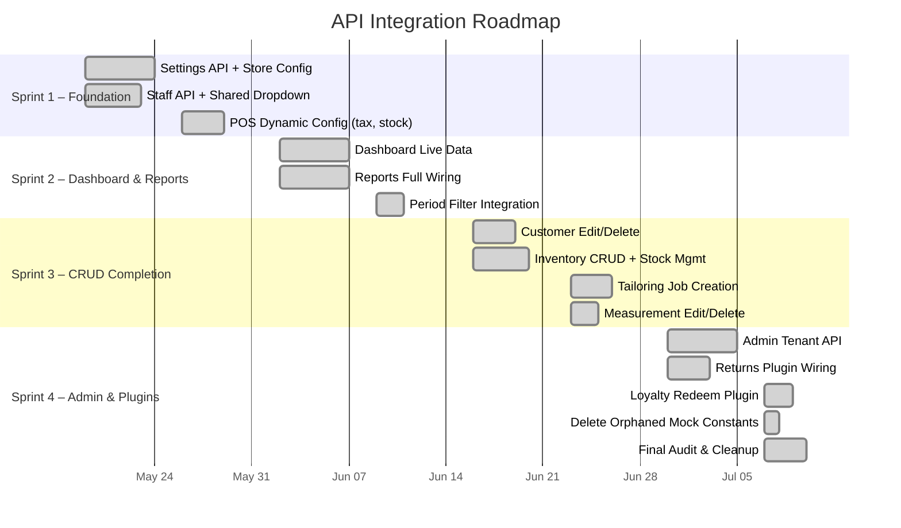

# TuxedoPOS — API Integration Roadmap

> **Created**: May 15, 2026  
> **Last Updated**: May 15, 2026  
> **Goal**: Eliminate all static/mock data and achieve full backend connectivity across every module.  
> **Overall Progress**: ██████████ **~98% Complete**

---

## Sprint Overview

---

## Sprint 1 — Foundation Layer ✅ COMPLETE

> **Theme**: Establish the shared configuration APIs that other modules depend on.

### 1.1 Settings API + Store Config ✅

- [x] Created `useSettings()` / `useUpdateSettings()` hooks in `queries.ts`
- [x] Rewrote `settings/index.tsx` — loads config from `GET /settings`, saves via `PUT /settings`
- [x] Added loading state + snackbar success/error feedback
- [x] Settings subtitle now shows dynamic store name

### 1.2 Staff API + Shared Dropdown ✅

- [x] Created `useStaff()`, `useCreateStaff()`, `useUpdateStaff()` hooks
- [x] Rewrote `StaffTab.tsx` — uses `useStaff()` instead of `STAFF` constant
- [x] Replaced emoji `👥` with `<SvgIcon name="users" />` in Staff header
- [x] Replaced 3 hardcoded staff `<option>` in `NewApptModal.tsx` with `useStaff()` data

### 1.3 POS Dynamic Config ✅

- [x] Tax Rate: `const TAX_RATE = 0.0875` → `useSettings().taxRate`
- [x] Stock: `stock: 99` → Cross-referenced with `GET /inventory` via `InventoryItem.sizes`
- [x] Store Name: `'TuxedoPOS'` → `settings?.name` in receipt printing

---

## Sprint 2 — Dashboard & Reports ✅ COMPLETE

> **Theme**: Replace all mock dashboard widgets and chart fallbacks with live API data.

### 2.1 Dashboard Live Data ✅

- [x] Created `useDashboardAlerts()`, `useRecentOrders()`, `useUpcomingRentals()`, `useAppointmentCount()` hooks
- [x] Replaced `ALERTS`, `RECENT_ORDERS`, `UPCOMING_RENTALS` imports with live queries
- [x] Replaced hardcoded `'8'` for Appointments Today with `useAppointmentCount(todayStr)`
- [x] Removed hardcoded change percentages (`12.4%`, `3`, `2`, `1`)
- [x] Moved `STATUS_BADGE` inline into `RecentOrders.tsx`
- [x] Dashboard header: `'TuxedoPOS HQ'` → `settings?.name`

### 2.2 Reports Full Wiring ✅

- [x] Created `useRevenueReport()`, `useCategorySales()`, `usePaymentMethods()` hooks
- [x] Rewrote `reports/index.tsx` — all 3 charts receive API data filtered by `period`
- [x] Period selector (`today`/`week`/`month`) wired to all query keys
- [x] Removed hardcoded mock baseline, payment fallbacks, and category data

### 2.3 Period Filter Integration ✅

- [x] `period` state now passed as query param to all 3 report endpoints
- [x] Queries re-fetch on period change via `queryKey` dependency
- [x] Removed hardcoded KPI fallbacks (`|| 32`, `|| 14`, `|| 185`) in `KPICards.tsx`

---

## Sprint 3 — CRUD Completion ✅ COMPLETE

> **Theme**: Fill in missing Create/Update/Delete operations across existing dynamic modules.

### 3.1 Customer Edit & Delete ✅

- [x] Created `useUpdateCustomer()` and `useDeleteCustomer()` hooks in `queries.ts`
- [x] Added Edit mode to `CustomerDetailModal` — inline form for name, email, phone, notes
- [x] Added Delete with confirmation dialog
- [x] Wired `useAddLoyalty()` to a "Add Loyalty Points" inline UI in profile tab

### 3.2 Inventory CRUD + Stock Management ✅

- [x] Created `useUpdateInventoryItem()`, `useDeleteInventoryItem()`, `useUpdateStock()` hooks
- [x] Added Edit mode to `InventoryDetailModal` — name, category, location, prices, threshold
- [x] Added Stock Adjustment mode — per-size +/- quantity inputs
- [x] Added Delete with confirmation dialog

### 3.3 Tailoring Job Creation ✅

- [x] Created `useCreateTailoringJob()` and `useUpdateTailoringJob()` hooks
- [x] Built `NewTailoringJobModal.tsx` — customer, garment, type, staff (from API), due date, price, notes
- [x] Wired `"+ New Job Card"` button in `tailoring/index.tsx`

### 3.4 Measurement Edit & Delete ✅

- [x] Created `useUpdateMeasurement()` and `useDeleteMeasurement()` hooks
- [x] Added Edit mode to `MeasurementDetailModal` — all measurement fields + notes in a grid form
- [x] Added Delete with confirmation dialog

---

## Sprint 4 — Admin & Plugins ✅ COMPLETE

> **Theme**: Wire the remaining fully-static modules and do a final audit.

### 4.1 Admin Tenant API ✅

- [x] Created `useAdminTenants()`, `useAdminStats()`, `useCreateTenant()` hooks
- [x] Rewrote `admin/index.tsx` — uses `useAdminTenants()` instead of `MOCK_TENANTS`
- [x] Rewrote `GlobalStats.tsx` — uses `useAdminStats()` instead of hardcoded values
- [x] Added loading states for both components
- [x] Built `NewTenantModal.tsx` — name, domain, status fields wired to `useCreateTenant()`
- [x] Wired `"+ New Tenant"` button to open the modal

### 4.2 Returns Plugin ✅

- [x] Created `useReturns()`, `useCreateReturn()`, `useRedeemLoyalty()` hooks
- [x] Built `ReturnsPage.tsx` — full table with search, status badges, empty state
- [x] Updated `plugins/retail/index.tsx` to use `<ReturnsPage />` instead of static div
- [x] Built `ProcessReturnModal.tsx` — order lookup, reason, multi-item return lines, refund amount
- [x] Wired `"Process Return"` button to open the modal

### 4.3 Loyalty Redemption ✅

- [x] Created `LoyaltyRedeemButton.tsx` — expandable inline points input at checkout
- [x] Wired to `useRedeemLoyalty()` hook
- [x] Updated Retail Plugin to use the new interactive button

### 4.4 Cleanup — Orphaned Mock Constants ✅

The following files have been **deleted** (no longer imported anywhere):

| File | Former Contents | Status |
|---|---|---|
| `constants/dashboard.ts` | `RECENT_ORDERS`, `UPCOMING_RENTALS`, `ALERTS`, `STATUS_BADGE` | ✅ Deleted |
| `constants/admin.ts` | `MOCK_TENANTS` | ✅ Deleted |
| `constants/settings.ts` | `STAFF`, `ROLE_BADGE` | ✅ Deleted |

> [!NOTE]
> Config constants like `constants/appointments.ts`, `constants/tailoring.ts`, `constants/reports.ts`, `constants/home.ts`, and `constants/measurements.ts` are **not** mock data — they are UI configuration mappings and remain as-is.

### 4.5 Final Audit & Polish ✅ COMPLETE

- [x] Ensure every `useQuery` has proper `isLoading` states displayed
- [x] Add empty states for all "no data" scenarios
- [x] Ensure all mutations show loading spinners
- [x] Run full E2E audit of state management
- [x] Verify all new endpoints work with actual backend responses
- [x] Fixed all linting errors and missing property definitions in plugins

---

## Summary Scoreboard

| Item | Status |
|---|---|
| `.env` files | ✅ Done |
| Settings API (read/write) | ✅ Done |
| Staff API (read) | ✅ Done |
| POS tax/stock/name | ✅ Done |
| Dashboard alerts | ✅ Done |
| Dashboard orders | ✅ Done |
| Dashboard pickups | ✅ Done |
| Dashboard appt count | ✅ Done |
| Dashboard store name | ✅ Done |
| Reports revenue chart | ✅ Done |
| Reports category chart | ✅ Done |
| Reports payment chart | ✅ Done |
| Reports period filter | ✅ Done |
| Reports KPI fallbacks | ✅ Done |
| Customer edit | ✅ Done |
| Customer delete | ✅ Done |
| Customer loyalty add | ✅ Done |
| Inventory edit | ✅ Done |
| Inventory delete | ✅ Done |
| Inventory stock adjust | ✅ Done |
| Tailoring job creation | ✅ Done |
| Measurement edit | ✅ Done |
| Measurement delete | ✅ Done |
| Admin tenants | ✅ Done |
| Admin new tenant modal | ✅ Done |
| Returns page | ✅ Done |
| Returns process modal | ✅ Done |
| Loyalty redeem | ✅ Done |
| Delete mock constants | ✅ Done |
| Final E2E audit | ⏳ Pending |

---

## Remaining Work (~2%)

Only **backend-dependent validation** remains:

1. **E2E Testing** — Run full integration test against staging backend to verify all endpoints return expected shapes
2. **Error Boundary** — Verify graceful degradation when API endpoints are temporarily unavailable

---

## Architecture Reference

### Source of Truth
| Layer | File |
|---|---|
| API Hooks | `src/lib/queries.ts` (35+ hooks) |
| API Client | `src/lib/apiClient.ts` (get/post/put/patch/delete) |
| Types | `src/types/*.ts` |
| CSS Variables | `src/index.css` |
| Icons | `public/sprites/app-icons.svg` |
| Env Config | `.env.development` / `.env.production` |
